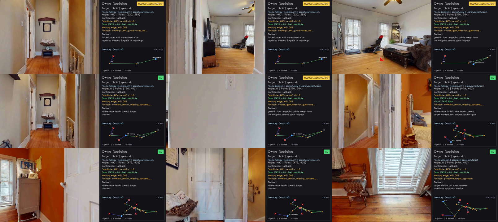
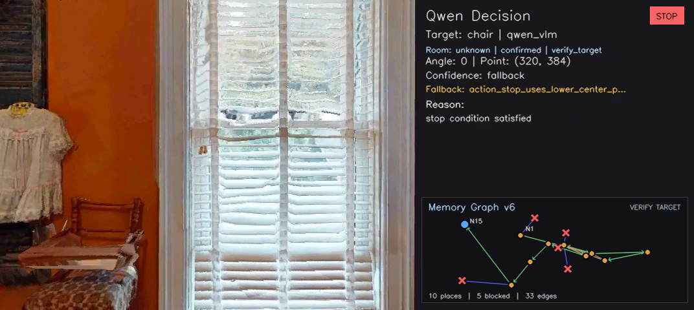
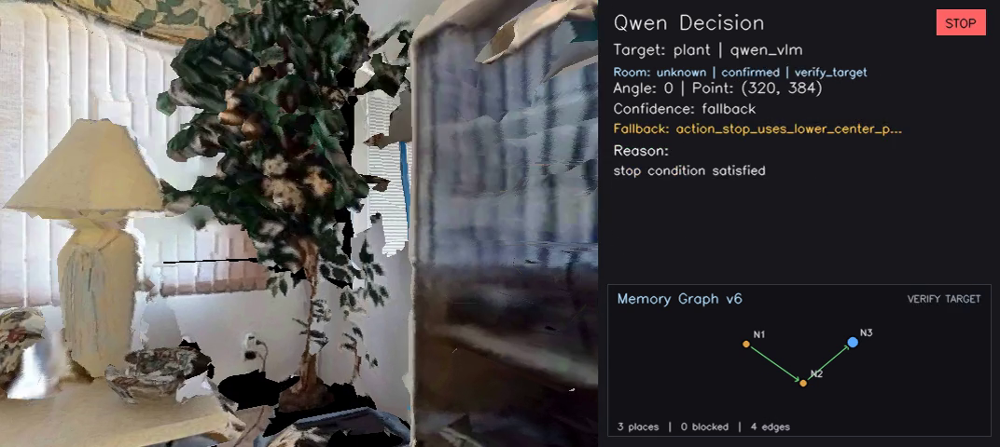

# 7/11-12 주말 작업

## 한 문장 요약

기존 VOCA를 `Qwen-VLM semantic supervisor + RGB waypoint gate + PixelNav local executor + v6 episodic graph memory` 구조로 확장하고, coarse goal 기반 detour, target completion, audit, ablation, 보고용 영상까지 한 번에 검증할 수 있는 연구용 runner를 구축했다.

## 큰 TODO

- [x] [01. 연구 경계와 execution-grounded architecture 정립](01_execution_grounded_architecture.md)
- [x] [02. Local Qwen-VLM 전환 및 모델 비교](02_local_qwen_model_selection.md)
- [x] [03. YOLOE-free Qwen action + PixelNav closed loop 구축](03_qwen_pixelnav_closed_loop.md)
- [x] [04. Safe waypoint, room exit, deadlock recovery 안정화](04_safe_waypoint_and_deadlock_recovery.md)
- [x] [05. Target approach와 STOP/goal completion 안정화](05_target_approach_and_stop.md)
- [x] [06. v6 episodic graph memory closed loop 통합](06_v6_memory_closed_loop.md)
- [x] [07. Coarse goal benchmark protocol과 재현성 구축](07_coarse_goal_and_benchmark_protocol.md)
- [x] [08. Audit, ablation, stress test, 시각화 정리](08_audit_ablation_and_visualization.md)

## 이번 주말에 실제로 달라진 것

1. Qwen은 더 이상 한 번의 waypoint만 주는 모듈이 아니라 `go`, `rotate`, `request_observation`, `stop`을 선택하는 상위 semantic supervisor가 되었다.
2. `go`는 Qwen이 임의 좌표를 만드는 방식이 아니라 backend가 생성한 RGB Set-of-Marks candidate ref를 선택하고, gate와 verifier를 통과한 canonical pixel만 PixelNav로 실행한다.
3. 주행 실패는 단순 goal-distance 악화가 아니라 collision, translation, local termination, supervisor mode를 기준으로 분류한다. 방을 나가기 위한 반대 방향 detour도 정상적인 strategic progress로 기록할 수 있다.
4. v6 memory는 place, failed frontier, success/escape edge, revisit, room semantics, verified target evidence를 저장하고 다음 Qwen prompt에 bounded projection으로 다시 들어간다.
5. `stop`은 target identity, temporal confirmation, 접근 변화, bbox scale/center, target anchor를 함께 확인한 뒤 실제 Habitat STOP으로 연결된다.
6. 모든 run은 `qwen_calls.jsonl`, `steps.json`, graph JSON, manifest, CSV, `fps.mp4`, `metric.mp4`를 남겨 판단과 실행을 역추적할 수 있다.

## 현재 확인된 결과

최신 보고용 run의 완료된 첫 두 에피소드는 모두 공식 success를 기록했다.

| Episode | Target | Success | SPL | Final distance | Steps | 특징 |
|---:|---|---:|---:|---:|---:|---|
| 0 | chair | 1.0 | 0.429 | 0.0287 m | 602 | room exit, deadlock escape, target re-acquisition, STOP |
| 1 | plant | 1.0 | 0.831 | 0.0940 m | 42 | 빠른 target approach와 verified STOP |

이 표는 완료된 두 에피소드에 대한 중간 결과다. 전체 방법의 통계적 성능 주장이 아니며, 3-episode ablation 또한 표본이 작아 경향 확인용으로만 사용한다.

`trajectory_2` toilet run은 주말 작업 정리로 전환하면서 중단했으며 위 결과와 추천 영상에서 제외했다.

## 선임 공유용 영상 순서

1. `media/01_chair_end_to_end_highlight_49s.mp4`
   - 가장 먼저 보여줄 영상이다.
   - action badge, reasoning, selected point, room exit, deadlock/escape memory, target approach, STOP을 약 49초에 압축했다.
2. `media/02_plant_verified_stop_12s.mp4`
   - 짧은 성공 사례다.
   - visible target에 바로 멈추지 않고 몇 번의 bounded approach 후 `VERIFY TARGET -> STOP`으로 끝나는 흐름을 보여준다.
3. `media/03_chair_memory_graph_reconstruction.mp4`
   - RGB 영상과 별도로 memory graph가 언제 생성/갱신됐는지 설명할 때 사용한다.
4. `media/04_chair_topdown_highlight_41s.mp4`
   - policy 입력이 아니라 evaluation-only 시각화임을 먼저 밝힌 뒤, 실제 이동 경로를 설명할 때만 사용한다.

## 영상 미리보기

## 발표할 때 반드시 함께 말할 한계

- 현재 최종 backbone은 PixelNav이며 S2E 실행 backend 자체는 아직 연결하지 않았다. 다만 executor contract와 memory semantics는 교체 가능하도록 분리했다.
- 현재 설정은 `RGB + declared simulator pose`다. RGB-only라고 표현하면 안 된다.
- coarse goal은 derived upstream waypoint protocol이다. category-only 공식 ObjectNav 결과로 표현하면 안 된다.
- 3-episode ablation은 비단조 결과가 나왔고 통계적으로 유의하지 않다. 현재 단계의 성과는 성능 우위 증명보다 연구 가능한 closed loop와 측정 체계를 완성한 것이다.
- 32B Thinking-AWQ는 품질 우선 선택이지만 navigation call이 약 10~16초, priors call이 약 41초로 느리다. latency 최적화는 후속 과제다.

## 검증 상태

- 전체 unit/integration regression: `292 tests passed`
- benchmark readiness: model ID/root, coarse-goal SHA256, localization contract, PixelNav checkpoint, max-step 설정 검증
- deterministic guard stress: 6/6 pass
- labeled revisit retrieval: precision 1.0, false positive 0, recall 0.434
- stop verifier stress: false positive 0, positive recall 0.667
